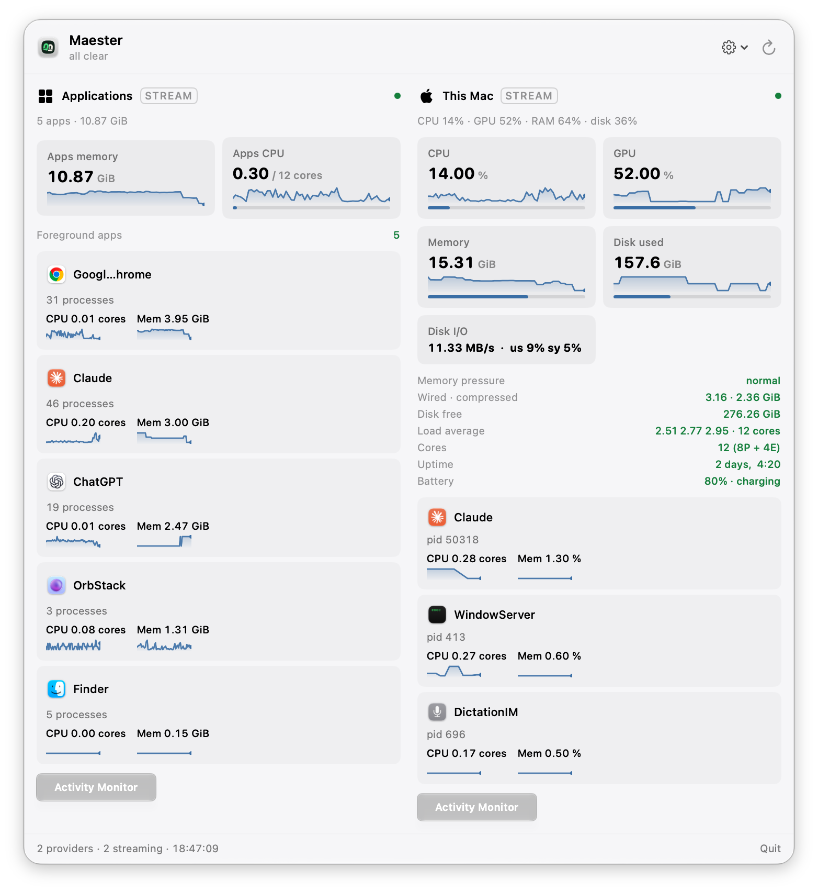
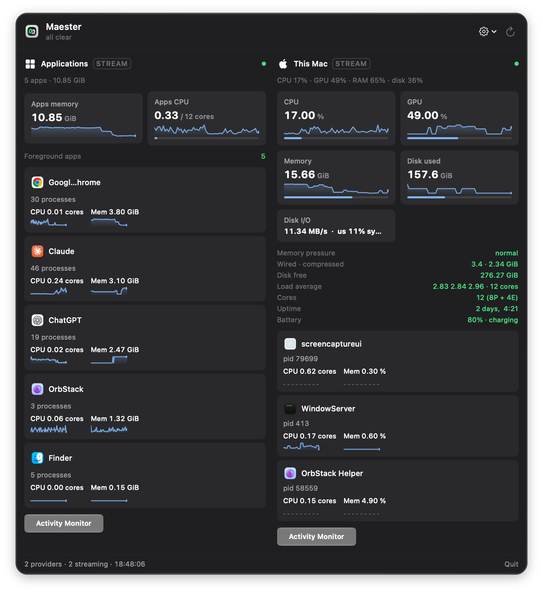
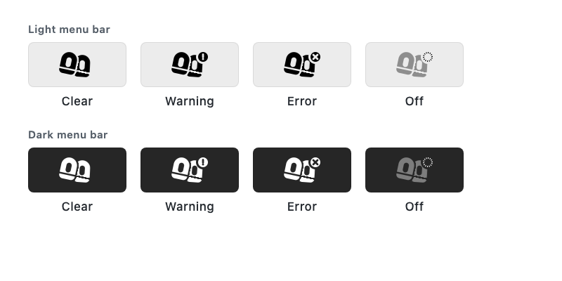

<p align="center">
  
</p>

# Maester

A macOS menu bar app that shows what is running on your Mac and what it is
consuming — CPU, GPU, memory, disk, running apps — and lets you act on it:
quit or force-quit a hung app, jump to Activity Monitor. No terminal, no Dock
icon, just a menu bar item and a panel.

<p>
  
  
</p>


## The point

Maester knows nothing domain-specific. It renders whatever *providers*
report, through a fixed contract. A provider is any executable that prints
JSON — monitoring a launchd job, a dev server, or a CI queue is a shell
script, not an app change. Two providers ship with it: the Mac itself, and
running applications.

The menu bar glyph is the worst state across every provider, so one glance
answers "does anything need me".



## Requirements

- macOS 15 or later
- Apple Silicon — there is no Intel build

Running Maester needs nothing else: `install.sh`, the bundled providers and
`maester-doctor` use only what ships with macOS, and none of them will
trigger the Xcode Command Line Tools prompt on a Mac that has no developer
tools. Building from source is the exception — `./build.sh` calls `swiftc`,
so it needs Xcode or the Command Line Tools installed. Use a
[Release](https://github.com/kishorekanthan/maester/releases) build to avoid
that.

## Install

**Build from source:**

```bash
git clone https://github.com/kishorekanthan/maester.git
cd maester
./install.sh        # symlinks providers into ~/.config/maester/providers
./build.sh           # -> ~/Applications/Maester.app
open -a ~/Applications/Maester.app
```

**Prebuilt app:** download `Maester-<version>.dmg` from the [latest
Release](https://github.com/kishorekanthan/maester/releases/latest), open it
and drag `Maester.app` to Applications. The `.zip` on the same page holds the
same bundle if you prefer a plain archive.

The app is ad-hoc signed and not notarized, so macOS refuses to open it the
first time. On macOS 15 and later the right-click **Open** shortcut no longer
bypasses this. Instead:

1. Open Maester once. When macOS says it cannot verify the app, click **Done**
   (not Move to Trash).
2. Open **System Settings → Privacy & Security**, scroll to Security, and click
   **Open Anyway** next to the Maester message.
3. Confirm with **Open Anyway** and your password.

This is a one-time step per download. From a terminal,
`xattr -dr com.apple.quarantine /Applications/Maester.app` does the same.

## No telemetry, no network calls

Maester makes no network requests of its own. What a provider does on your
behalf is that provider's business — the built-in `mac` and `apps` providers
read local system state only and call nothing over the network.

## Cost

Idle self-cost is under 1% CPU — see [docs/performance.md](docs/performance.md)
for the measurement and method. `mac` streams from a single long-lived
`iostat` rather than polling it, the panel only redraws while it's open, and
every provider is supervised: a stalled stream restarts with backoff rather
than being polled forever.

## Feature ceiling

What the OS version changes. Everything not listed here behaves identically
on every supported version.

| Feature | macOS 26+ | macOS 15 |
| --- | --- | --- |
| Panel buttons | `.glassProminent` / `.glass` | `.bordered` |

A missing SF Symbol degrades to a plain state mark rather than rendering
blank, so a symbol introduced after your OS costs an icon, not a hole in the
panel.

## Writing a provider

A provider is any executable, in any language, dropped into
`~/.config/maester/providers/`. It needs to answer one subcommand,
`status`, with one line of JSON on stdout. Here it is end to end, written
and run from a shell:


Here is a complete one, in zsh, that reports whether the current directory
is a git repo with uncommitted changes:

```zsh
#!/usr/bin/env zsh
set -uo pipefail

JQ=/usr/bin/jq
GIT=/usr/bin/git

dirty="$("$GIT" status --porcelain 2>/dev/null | wc -l | tr -d ' ')"
if [[ -z "$dirty" ]]; then
  state="off"; summary="not a git repo"
elif [[ "$dirty" -eq 0 ]]; then
  state="ok"; summary="clean"
else
  state="warn"; summary="$dirty file(s) changed"
fi

"$JQ" -n --arg state "$state" --arg summary "$summary" \
  '{schema: 1, title: "Git", state: $state, summary: $summary}'
```

Make it executable, drop it in `~/.config/maester/providers/`, and it shows
up as a section in the panel. Read [CONTRACT.md](CONTRACT.md) for the full
shape — streaming updates, metrics, items, and actions — and check your work
with:

```bash
maester-doctor <name> --stream
```

## Turning providers off

`~/.config/maester/config.json` holds an opt-out list:

```json
{ "disabled": ["apps"] }
```

A name in `disabled` is never spawned. Anything not named runs, so a newly
dropped provider works with no config change. Toggle providers from the gear
menu in the panel, or hand-edit the file — it's reread on the same schedule
as provider discovery, so an edit takes effect without a relaunch.

## Checking for container runtimes

```bash
./setup.sh
```

reports whether `docker`, `podman` and `kubectl` are installed and answering
on this machine.

**It is read-only.** It writes nothing, configures nothing, and does not
enable or disable any provider — running it changes no file on disk. The
bundled `mac` and `apps` providers do not use these runtimes at all; the
report exists so that if you write a container provider, you can see in one
command what it would find. To turn providers on or off, edit
`config.json` as described above.

## Debugging

```bash
MAESTER_DEBUG=1 ~/Applications/Maester.app/Contents/MacOS/Maester
```

traces state changes, stream restarts, refused providers, and action results
to stderr. Off by default, since a menu bar app is otherwise unobservable
from a shell.

## Contributing

```bash
./check.sh
```

builds the app, runs the shell test suite, the complexity gate
(`swiftlint`), and the no-comments check, in that order. Run it before
sending a change; CI runs the same script. See
[CONTRIBUTING.md](CONTRIBUTING.md) for the rest.

## What the bundled numbers mean

The bundled `mac` and `apps` providers report specific, named measurements
rather than an all-purpose "usage" figure. The distinctions matter when a
reading looks surprising.

| Reading | What it is |
| --- | --- |
| Memory | `(anonymous − purgeable + wired + compressor) × page size` from `vm_stat`, over `hw.memsize`. This is the app-and-kernel footprint that cannot simply be dropped; file-backed resident pages are excluded, and the compressor term is the physical storage the compressor occupies. It is not Activity Monitor's "Memory Used" and the two will differ. |
| Apps memory | The sum of each process's resident set size (`ps rss`), grouped by app. RSS attributes a shared page to every process mapping it, so pages shared between apps are counted more than once. Read it as summed RSS, an attribution, not as reclaimable physical RAM — it is not comparable with the Memory tile above. |
| Apps CPU | Core-equivalents: CPU seconds accumulated between samples, divided by elapsed time. `2.0 / 10 cores` means two cores' worth of work. The total covers every foreground app, including those past the twelve shown as rows. |
| CPU | `100 − idle` from `iostat`, an aggregate percentage of the whole machine, not core-equivalents. |
| Data volume | `df` on `/System/Volumes/Data`, the startup volume's data partition only. Other volumes, external disks, and other APFS volumes in the same container are excluded. APFS free space is shared across a container, so the free figure can move because of a volume this number does not show. |
| Disk I/O | Throughput summed across devices over the one-second `iostat` sample. It is a rate for the whole machine, not a total and not specific to the Data volume. |

When the text these providers parse does not match what they expect, they omit
the metric and say so on stderr rather than substituting a default. A missing
row means "not measured", never "zero".

## License

[MIT](LICENSE). Copyright (c) 2026 Kishore Kanthan.
